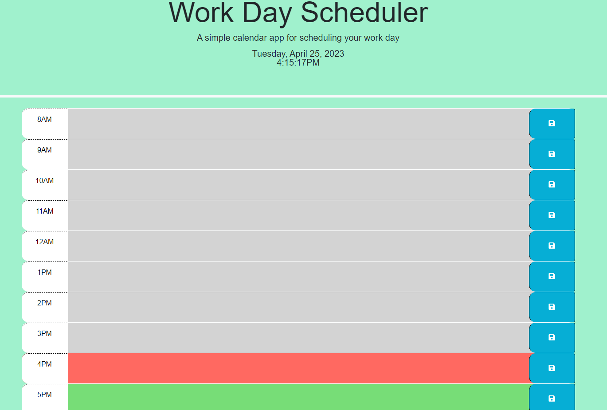

# 05 Third-Party APIs: Work Day Scheduler

## My Task

To create a simple calender allowing the user to type and save events for the hours of their work day. Using HTML and CSS with jQuery the user is able to know the time and day while showing a visual of the current time on the calender.

## Demonstration

The following animation demonstrates the application functionality:

<!-- @TODO: create ticket to review/update image) -->

### Deployed Application

* Live URL: https://aiyholl5.github.io/Work-Day-Scheduler/

* GitHub URL: https://github.com/aiyholl5/Work-Day-Scheduler

* Screenshot of deployed application:

## Credits

MIT License

Copyright (c) [year] [fullname]

Permission is hereby granted, free of charge, to any person obtaining a copy of this software and associated documentation files (the "Software"), to deal in the Software without restriction, including without limitation the rights to use, copy, modify, merge, publish, distribute, sublicense, and/or sell copies of the Software, and to permit persons to whom the Software is furnished to do so, subject to the following conditions:

The above copyright notice and this permission notice shall be included in all copies or substantial portions of the Software.

THE SOFTWARE IS PROVIDED "AS IS", WITHOUT WARRANTY OF ANY KIND, EXPRESS OR IMPLIED, INCLUDING BUT NOT LIMITED TO THE WARRANTIES OF MERCHANTABILITY, FITNESS FOR A PARTICULAR PURPOSE AND NONINFRINGEMENT. IN NO EVENT SHALL THE AUTHORS OR COPYRIGHT HOLDERS BE LIABLE FOR ANY CLAIM, DAMAGES OR OTHER LIABILITY, WHETHER IN AN ACTION OF CONTRACT, TORT OR OTHERWISE, ARISING FROM, OUT OF OR IN CONNECTION WITH THE SOFTWARE OR THE USE OR OTHER DEALINGS IN THE SOFTWARE.